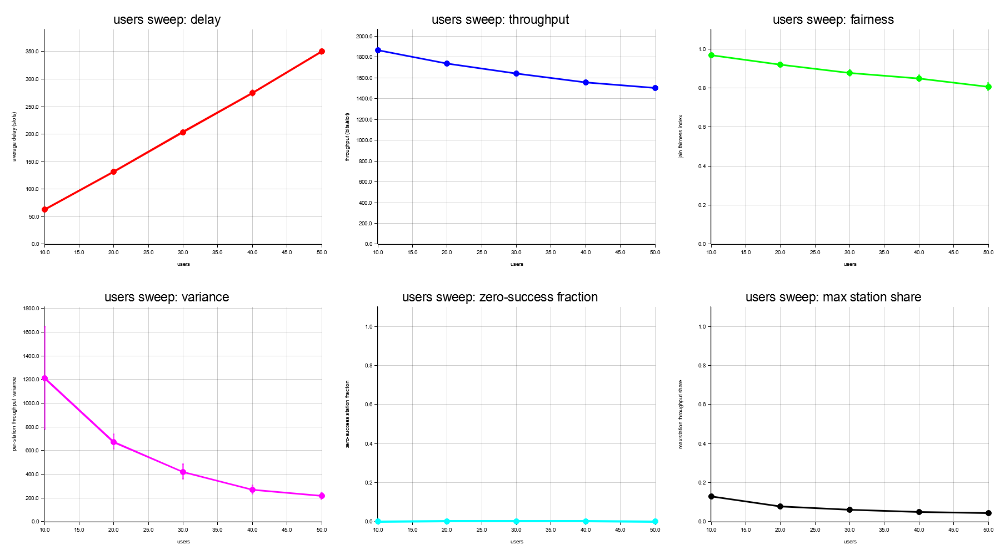
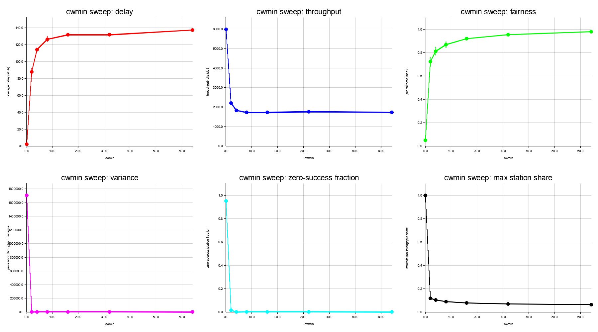
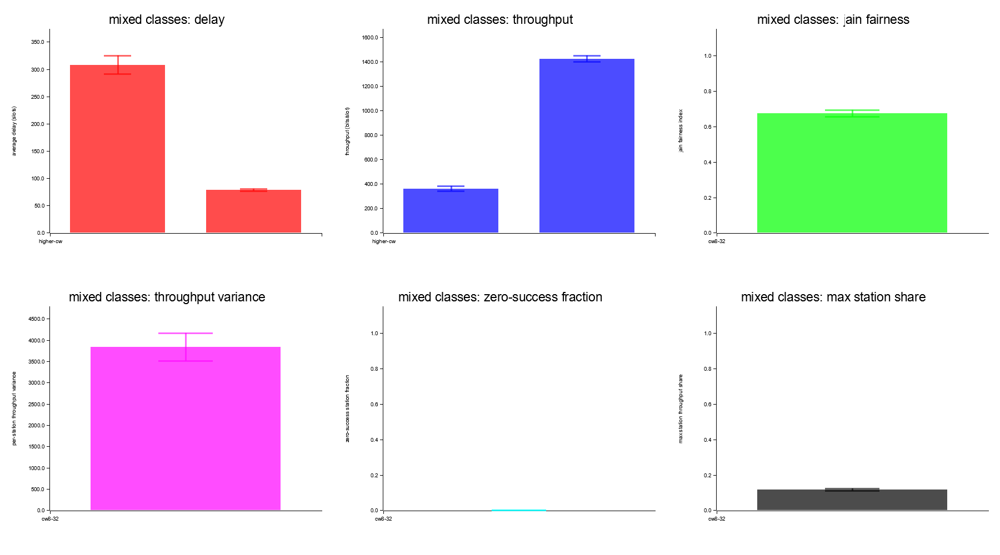

# CSMA/CA Simulator

### Reproducible DCF Study in Rust

- Explicit slot-based CSMA/CA model
- Deterministic experiment pipeline
- Plot and report generation
- Interactive terminal demo

References: [../README.md](../README.md) | [dcf-model.md](dcf-model.md) | [usage-guide.md](usage-guide.md) | [../results/report.md](../results/report.md)

---

## What Was Delivered

- A simulator for CSMA/CA / IEEE 802.11 DCF-style contention
- Delay and throughput analysis by varying user count
- Delay and throughput analysis by varying `cw_min`
- Two-class comparison showing lower-`cw_min` advantage
- CSV summaries, PNG plots, markdown report, and trace files
- Interactive TUI demo using the same simulation core

Main code areas:

- [../src/app/cli.rs](../src/app/cli.rs)
- [../src/app/experiments/mod.rs](../src/app/experiments/mod.rs)
- [../src/sim/dcf/engine.rs](../src/sim/dcf/engine.rs)
- [../src/app/summary.rs](../src/app/summary.rs)
- [../src/app/plot.rs](../src/app/plot.rs)
- [../src/app/tui.rs](../src/app/tui.rs)

---

## Architecture

```text
CLI -> Scenario builder -> Experiment runner -> DCF engine
    -> Raw trial records -> Summary statistics -> Plots / Report / Demo traces
```

Design split:

- Scenario and configuration types: [../src/domain](../src/domain)
- Simulation engine and DCF state: [../src/sim/dcf](../src/sim/dcf)
- Experiment, plotting, reporting, and demo tooling: [../src/app](../src/app)

The design keeps the model explicit and inspectable while separating experiment/reporting concerns from the simulator core.

---

## Scenario Model

Each run is defined by seed, timing, contention-window cap, and station classes.

```rust
pub struct Scenario {
    pub seed: u64,
    pub timing: TimingConfig,
    pub window: WindowConfig,
    pub classes: Vec<StationClass>,
}
```

Source: [../src/domain/scenario.rs](../src/domain/scenario.rs)

Baseline assumptions:

- Saturated traffic
- One shared collision domain
- Logical timing slots instead of PHY-accurate microseconds
- Deterministic seeded execution

Model details: [dcf-model.md](dcf-model.md)

---

## DCF Engine

At each slot:

1. Busy medium blocks countdown.
2. Idle medium allows defer and backoff progression.
3. No contenders means idle slot.
4. One contender means success.
5. Multiple contenders means collision.

Representative logic from [../src/sim/dcf/engine.rs](../src/sim/dcf/engine.rs):

```rust
match resolve_transmission(contenders) {
    TransmissionResolution::Idle => {
        self.medium.observe_idle_slot();
        advance_idle_slot(&mut self.stations);
    }
    TransmissionResolution::Success { station_id } => {
        self.medium.start_busy(self.timing.busy_slots_after_success());
        handle_success(&mut self.stations, station_id, &mut self.rng)?;
    }
    TransmissionResolution::Collision { station_ids } => {
        self.collision_events += 1;
        self.medium.start_busy(self.timing.busy_slots_after_collision());
        handle_collision(&mut self.stations, &station_ids, &mut self.rng)?;
    }
}
```

Collision backoff update:

$$cw_{next} = \min(cw_{max}, 2 \cdot cw_{current} + 1)$$

---

## How Results Are Produced

Experiment families:

- User sweep: fixed `cw_min`, increasing users
- CW sweep: fixed users, varying `cw_min`
- Mixed classes: lower-`cw_min` and higher-`cw_min` in one shared medium

Repository workflow:

```powershell
cargo run -- sweep-users --min-users 10 --max-users 50 --step 10 --cw-min 16 --trials 10 --timing-preset baseline --output results/users.csv
cargo run -- sweep-cw --users 20 --cw-values 0,2,4,8,16,32,64 --trials 10 --timing-preset baseline --output results/cw.csv
cargo run -- mixed-classes --lower-users 10 --higher-users 10 --lower-cw-min 8 --higher-cw-min 32 --trials 10 --timing-preset baseline --output results/mixed.csv
cargo run -- plot --users-input results/users-summary.csv --cw-input results/cw-summary.csv --mixed-input results/mixed-summary.csv --output-dir results/plots
cargo run -- report --users-input results/users-summary.csv --cw-input results/cw-summary.csv --mixed-input results/mixed-summary.csv --plots-dir results/plots --output results/report.md
```

Generated artifacts:

- [../results/users-summary.csv](../results/users-summary.csv)
- [../results/cw-summary.csv](../results/cw-summary.csv)
- [../results/mixed-summary.csv](../results/mixed-summary.csv)
- [../results/plots/users.png](../results/plots/users.png)
- [../results/plots/cw.png](../results/plots/cw.png)
- [../results/plots/mixed.png](../results/plots/mixed.png)
- [../results/report.md](../results/report.md)

---

## Metrics Used

Primary metrics:

- Average delay in slots
- Throughput in bits per slot

Fairness metrics:

- Jain fairness index
- Per-station throughput variance
- Zero-success station fraction
- Max-station throughput share

This avoids misleading conclusions from throughput alone when aggressive configurations create channel capture.

---

## Result 1: Increasing Users



| Users | Avg delay | Throughput | Jain fairness |
| --- | ---: | ---: | ---: |
| 10 | 63.07 | 1864.20 | 0.9666 |
| 20 | 131.52 | 1736.40 | 0.9181 |
| 30 | 203.29 | 1640.04 | 0.8770 |
| 40 | 274.40 | 1555.14 | 0.8499 |
| 50 | 349.93 | 1502.16 | 0.8065 |

Observed behavior:

- Delay grows strongly with more contenders
- Throughput declines as collision pressure increases
- Fairness also degrades with crowding

Artifacts: [../results/users-summary.csv](../results/users-summary.csv) | [../results/plots/users.png](../results/plots/users.png)

---

## Result 2: Varying CWmin



| CWmin | Avg delay | Throughput | Jain fairness | Zero-success frac | Max-station share |
| --- | ---: | ---: | ---: | ---: | ---: |
| 0 | 2.00 | 5991.42 | 0.0500 | 0.9500 | 1.0000 |
| 8 | 126.35 | 1732.86 | 0.8670 | 0.0000 | 0.0898 |
| 16 | 131.52 | 1736.40 | 0.9181 | 0.0000 | 0.0778 |
| 32 | 131.53 | 1768.56 | 0.9545 | 0.0000 | 0.0694 |
| 64 | 137.24 | 1722.06 | 0.9789 | 0.0000 | 0.0640 |

Observed behavior:

- Very small `cw_min` is extremely aggressive
- High throughput at `cw_min = 0` comes with severe unfairness and starvation
- Moderate and larger `cw_min` values improve fairness and reduce capture
- Best settings must be judged with fairness and starvation metrics, not throughput alone

Artifacts: [../results/cw-summary.csv](../results/cw-summary.csv) | [../results/plots/cw.png](../results/plots/cw.png)

---

## Result 3: Mixed Classes



| Class | Users | Avg delay | Throughput | Per-user throughput |
| --- | ---: | ---: | ---: | ---: |
| lower-cw | 10 | 79.12 | 1423.62 | 142.36 |
| higher-cw | 10 | 307.85 | 362.82 | 36.28 |

| Jain fairness | Variance | Zero-success frac | Max-station share |
| ---: | ---: | ---: | ---: |
| 0.6764 | 3838.550760 | 0.0000 | 0.1174 |

Observed behavior:

- Lower-`cw_min` users access the medium faster
- Lower-`cw_min` users achieve much lower delay
- Lower-`cw_min` users take a much larger throughput share
- The requested class advantage is clearly demonstrated

Artifacts: [../results/mixed-summary.csv](../results/mixed-summary.csv) | [../results/plots/mixed.png](../results/plots/mixed.png)

---

## Validation

- Deterministic seeded runs are tested in [../tests/simulation.rs](../tests/simulation.rs)
- Mixed-class advantage is tested in [../tests/simulation.rs](../tests/simulation.rs)
- Summary outputs are checked against golden values in [../tests/experiment_summaries.rs](../tests/experiment_summaries.rs)
- Repository quality gates include formatting, clippy, tests, and pre-commit hooks

Validation commands:

```powershell
cargo fmt --all
cargo clippy --all-targets --all-features -- -D warnings
cargo test
pre-commit run --all-files
```

---

## Interactive Demo

```powershell
cargo run -- demo --preset mixed --slots 180 --seed 7 --compare-cw-min 8 --tick-ms 150
```

Alternatives:

```powershell
cargo run -- demo --preset single --slots 60 --seed 7 --tick-ms 150
cargo run -- demo --preset collision --slots 120 --seed 7 --tick-ms 150
cargo run -- demo --replay results/traces/mixed-seed7.json --tick-ms 150
```

Controls:

- `space` pause/resume
- `n` next slot
- `f` faster
- `s` slower
- `r` restart
- `t` captions on/off
- `q` quit

Implementation: [../src/app/tui.rs](../src/app/tui.rs)

---

## Demo Scenario In Code

Mixed demo preset from [../src/app/tui.rs](../src/app/tui.rs):

```rust
DemoPreset::Mixed => Scenario::mixed(
    5,
    5,
    4,
    16,
    seed,
    TimingConfig {
        total_slots: slots,
        payload_bits: 12_000,
        difs_slots: 1,
        sifs_slots: 0,
        tx_duration_slots: 1,
        collision_penalty_slots: 4,
    },
    63,
)
```

The demo is not separate from the simulator. It uses the same scenario model, trace generation, and DCF engine as the experiment pipeline.

---

## Conclusion

- The project delivers the required simulator, sweeps, plots, class comparison, and live demo
- The implementation is explicit and easy to trace from assumptions to results
- More users increase delay and reduce throughput
- `cw_min` introduces an efficiency versus fairness tradeoff
- Lower `cw_min` gives a clear advantage in mixed contention

Supporting material:

- [../results/report.md](../results/report.md)
- [../src/sim/dcf/engine.rs](../src/sim/dcf/engine.rs)
- [../src/app/experiments/mod.rs](../src/app/experiments/mod.rs)
- [../src/app/tui.rs](../src/app/tui.rs)
